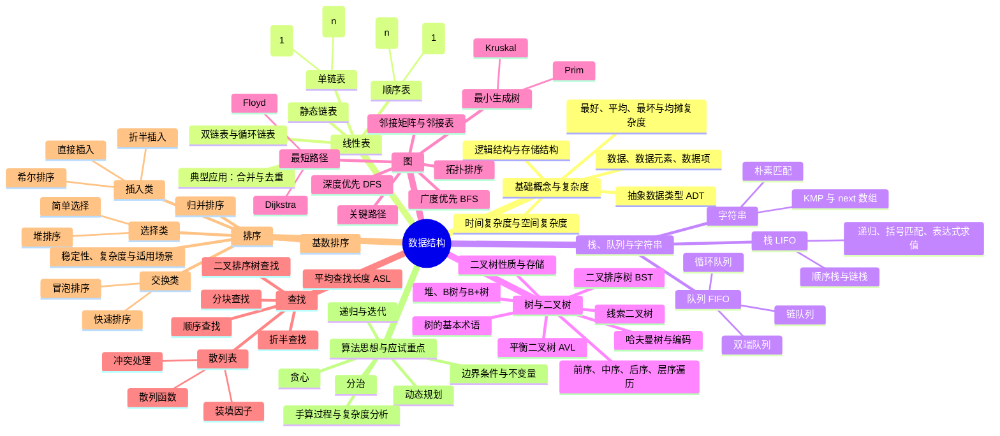

# 数据结构思维导图（可编辑源文件）

```mermaid
mindmap
  root((数据结构))
    基础概念与复杂度
      数据、数据元素、数据项
      逻辑结构与存储结构
      抽象数据类型 ADT
      时间复杂度与空间复杂度
      最好、平均、最坏与均摊复杂度
    线性表
      顺序表
        随机访问 O(1)
        插入删除 O(n)
      单链表
        按位查找 O(n)
        已知结点插入 O(1)
      双链表与循环链表
      静态链表
      典型应用：合并与去重
    栈、队列与字符串
      栈 LIFO
        顺序栈与链栈
        递归、括号匹配、表达式求值
      队列 FIFO
        循环队列
        链队列
        双端队列
      字符串
        朴素匹配
        KMP 与 next 数组
    树与二叉树
      树的基本术语
      二叉树性质与存储
      前序、中序、后序、层序遍历
      线索二叉树
      二叉排序树 BST
      平衡二叉树 AVL
      哈夫曼树与编码
      堆、B树与B+树
    图
      邻接矩阵与邻接表
      深度优先 DFS
      广度优先 BFS
      最小生成树
        Prim
        Kruskal
      最短路径
        Dijkstra
        Floyd
      拓扑排序
      关键路径
    查找
      顺序查找
      折半查找
      分块查找
      二叉排序树查找
      散列表
        散列函数
        冲突处理
        装填因子
      平均查找长度 ASL
    排序
      插入类
        直接插入
        折半插入
        希尔排序
      交换类
        冒泡排序
        快速排序
      选择类
        简单选择
        堆排序
      归并排序
      基数排序
      稳定性、复杂度与适用场景
    算法思想与应试重点
      递归与迭代
      分治
      贪心
      动态规划
      边界条件与不变量
      手算过程与复杂度分析
```
